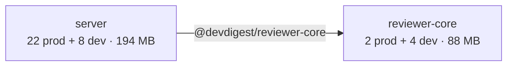

# dependency-checker — what we depend on, what it costs, what to fix first

A dependency report is only useful if a developer can act on it. Three failure
modes make one useless: numbers with no source, findings with no owner
("consider optimising dependencies"), and a flat list where a broken graph and a
big icon library sit at the same level. This skill exists to prevent all three.

**The rule that governs everything below: measure, then judge — never estimate.**
A number you did not read from a file, a command or the data you were given does
not go in the report.

## When to use

- "check / audit / map our dependencies", "what does X weigh", "why is
  `node_modules` 1 GB", "draw the dependency graph"
- before a major upgrade, a bundle-size push, or a security sweep
- when a new package is added and you want to know what it dragged in

**Not for**: reviewing a diff (`/code-review`), layer boundaries inside one
package (`onion-architecture`), or applying the fixes. This skill produces a
report and recommendations; changing `package.json` is a separate, confirmed step.

## Two modes

| Mode | When | What you do |
|---|---|---|
| **Measured** | You can run commands | Run the collector (below), report its numbers |
| **Supplied** | The data is already in the prompt, or you have no tool access | Reason over exactly what you were given. Do **not** ask for tool access, do **not** stall — produce the full report from the supplied data, and mark anything you could not determine as `unknown` rather than guessing |

Both modes produce the *same report structure*. The only difference is where the
numbers came from — say which, once, in the Scope section.

## Step 1 — collect

One command produces the whole fact base:

```bash
node scripts/deps-report.mjs --json
```

It reads every `package.json`, resolves each installed tree, measures the bytes
on disk, scans the source for real import sites, and returns a JSON model:
`packages[]` (counts, sizes, directs, duplicates, unreferenced, undeclared,
misplaced, deepImports), `repo` (sharedDependencies, crossPackageCopies,
internalEdges, vendorMirror) and mechanical `findings[]`. Add `--outdated`
`--audit` only when the user wants the network lanes — they hit the registry.
Human-readable variant: drop `--json`; `--out <file>` writes it instead of
printing. See [the collector's usage header](../../../scripts/deps-report.mjs).

When the script is unavailable, fall back to the primitives — and say in Scope
that the numbers came from them:

| Question | Command |
|---|---|
| What is declared | `cat <pkg>/package.json` |
| What is installed | `pnpm ls --json --depth Infinity` · `npm ls --json --all` |
| What it weighs | `du -sh <pkg>/node_modules/*` |
| Is it actually imported | `rg -n "from ['\"]<name>" <pkg>/src` |
| Internal edges | `paths` in each `tsconfig.json` |

**Never** run `pnpm install`, `npm audit fix`, `npm update` or any command that
mutates a lockfile while gathering facts.

## Step 2 — classify before you rank

Two kinds of dependency live in this repo and they are never mixed in the report:

- **External** — npm packages from a registry, declared in one of the six
  `package.json` files, installed into that package's own `node_modules`.
- **Internal** — one package's code reaching into another's, through a
  **TypeScript path alias** (`@devdigest/shared`, `@devdigest/reviewer-core`,
  `@/*`) resolved by `tsconfig.json`.

This repo is **not** a monorepo workspace: six independent packages, six
lockfiles, two package managers (pnpm for `server/`, `client/`, `evals/`; npm for
`reviewer-core/`, `e2e/`, `mcp/`). There are no `workspace:*` links and no
hoisted root `node_modules` — never describe the internal edges as workspace
packages, and never suggest a fix that assumes a workspace unless the user asks
about migrating to one.

Two consequences worth stating in every report where they show up:

- the same library is installed once **per package**, so one version bump is six
  edits and one library can occupy six times its size on disk;
- an internal edge taken by a **relative path** (`../reviewer-core/src/thing.js`)
  instead of the alias bypasses the package's public entry point — that is a
  boundary violation, not a stylistic preference.

## Step 3 — rank

Every finding carries exactly one tier. The tier is decided by the rules below,
not by how interesting the finding is.

| Tier | Meaning | Typical members |
|---|---|---|
| **P0** | The graph contradicts itself or ships a known vulnerability. Something is already wrong at runtime or one update away from breaking | high/critical advisory · two **majors** of a library we declare ourselves · a package imported at runtime but declared in no `package.json` (phantom) · a relative import reaching into another package's internals · a wire-crossing contract built by two different majors |
| **P1** | Wrong but working. Costs money, trust or a future afternoon | build/test tooling in `dependencies` · a declared dependency nothing imports · minor version drift of one library across packages · a deprecated package · vendor copies of a shared contract that have diverged |
| **P2** | Weight and drift. A conscious trade-off, not a defect | a heavy prod dependency with few call sites · duplicate versions deep in someone else's subtree · a major release we are behind on |
| **Info** | Context. No action implied | the same library installed by several packages (a fact about the repo layout) · packages running install scripts · patch-level resolution differences between lockfiles |

Ordering inside a tier: by evidence size — bytes, import sites, number of
packages affected. When two findings share a root cause, merge them into one and
list the affected packages in the evidence.

## Step 4 — write the report

Use this skeleton verbatim, in this order. Sections with nothing to say are kept
with one line saying so — a missing section reads as an oversight. This applies
to a chat answer as much as to the written file: a shorter question does not
license a different shape, and inventing your own headings ("Critical Issues",
"Recommendations") in place of these is the most common way this skill goes
wrong. **The `mermaid` block is the one section prose cannot replace** —
describing the graph in words is not producing it. Measured: on a short prompt
the graph is the first thing dropped, and it is the section the report exists
for.

````markdown
# Dependency report — <date>

## Scope
Which packages were analysed, which package manager and lockfile each uses, and
where the numbers came from (measured by `scripts/deps-report.mjs` / supplied in
the request / read by hand). One sentence stating this is six independent
packages sharing code through path aliases, not a workspace.

## Dependency graph



Internal edges are path aliases; external packages appear only when they are
part of the point being made (a shared library, a duplicated version). Label
every edge with the alias and, where known, the number of import sites.

## Size & weight
A table, not prose. One row per notable dependency:
| Package | Dependency | Type | Version | Exclusive size | Import sites |
Explain the column that is not obvious: *exclusive size* is what disappears if
the dependency goes — its subtree minus everything another dependency also pulls
in. Follow with the per-package totals and, when it applies, what the repo pays
for installing the same library N times.

Any cell you could not measure is `unknown` **followed by the one command that
would establish it** — `unknown (install its dependencies and re-run
\`node scripts/deps-report.mjs\`)`. Measured, 2026-08-26: the `unknown` lands
every time and the recovery step never does, because rule 5 below is read once
at the start and this table is written at the end. A reader who finds `unknown`
with no way forward is left exactly where they started.

## Internal dependencies
The alias edges, the import counts, any relative import crossing a package
boundary, and the state of the duplicated `@devdigest/shared` copies. Kept
separate from the npm tables on purpose: nothing here is installed. **Say that
in the report, not just in your head** — open the section with one sentence
stating that these edges resolve through TypeScript path aliases to files in
this repo and are never installed from a registry. A reader who skips the npm
tables and lands here has to be told which kind of dependency they are looking
at.

## Findings & Priorities
### P0 — <n>
### P1 — <n>
### P2 — <n>
### Info — <n>
One row or bullet per finding: what it is, the evidence with its number, the
file or `package.json` it lives in, and the direction of the fix. Empty tiers
are printed as "none".

## Summary
Three to five numbered takeaways, ordered by priority, each naming a concrete
package and a concrete action. This is what a developer reads if they read
nothing else.
````

## Rules of evidence

1. **Name the thing.** Every finding names a package, a dependency and, where one
   exists, a file: `server/package.json → dependency-cruiser`, not "some backend
   tooling". A finding you cannot locate is not a finding.
2. **Carry the number.** "large" is not a measurement. `111.9 MB exclusive,
   1 import site` is.
3. **Separate what you measured from what you inferred.** An unreferenced
   dependency found by import scanning is a *candidate*: config files, plugin
   systems and framework conventions load packages without an import. Say
   "no import found in `server/src` — confirm before removing", never "unused".
4. **Recommend; do not execute.** Removing a dependency, bumping a major and
   editing a lockfile are the user's calls. Present them as proposals with the
   command they would run, and stop.
5. **No invented data.** If the resolved version, the size or the advisory is
   unknown, write `unknown` and say what would establish it. Never fill a table
   cell to make it look complete. **Both halves are required** — an `unknown`
   on its own is a dead end for the reader. Write the recovery step next to it,
   in the same sentence: `unknown — install its dependencies and re-run
   \`node scripts/deps-report.mjs\` to measure it`. Measured: the `unknown`
   lands reliably and the recovery step is the half that gets dropped.
6. **One report, not a monologue.** Full report to the file, a short summary to
   chat — the top findings and the priority order, nothing more.

## Output

- Write the full report to `docs/dependencies/<YYYY-MM-DD>-deps.md` (create the
  directory if missing; same-day rerun gets `-2`). It is a snapshot: keeping the
  old ones is what makes drift visible later.
- Print to chat: the counts per tier, the three strongest findings, and the
  numbered summary. Link the file.
- Offer the follow-up as a question, never as an action already taken: "shall I
  move `dependency-cruiser` to devDependencies in `server/package.json`?"

## Anti-patterns

| Anti-pattern | Why it fails |
|---|---|
| A flat bullet list of every finding | The reader cannot tell a broken graph from a big icon set. Tiers exist for that |
| "Consider reviewing your dependencies" | Advice with no subject is noise; name the package or drop the line |
| Reporting `du -sh node_modules` as *the* size | It counts dev tooling, platform binaries and duplicates. Split prod / dev-only / unattributed |
| Calling an unimported dependency "unused" | Config-driven and framework-loaded packages have no import site. Say "no import found", propose a check |
| Describing the packages as a workspace | They are not linked; a fix built on that assumption will not work |
| Redrawing the whole npm tree in Mermaid | 962 nodes is not a diagram. Graph the packages and the edges that carry the finding |
| Running the report and then "fixing" it | Measurement and mutation are separate steps, and the second one needs a yes |

## Related

- [collector script](../../../scripts/deps-report.mjs) — the fact base, offline by default
- [mermaid-diagram](../mermaid-diagram/SKILL.md) — diagram syntax when the graph gets complicated
- [onion-architecture](../onion-architecture/SKILL.md) — layer boundaries *inside* `server/` and `reviewer-core/`
- [security](../security/SKILL.md) — what to do with an advisory once `--audit` surfaces one
