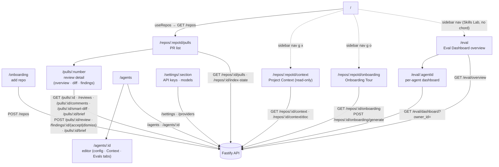
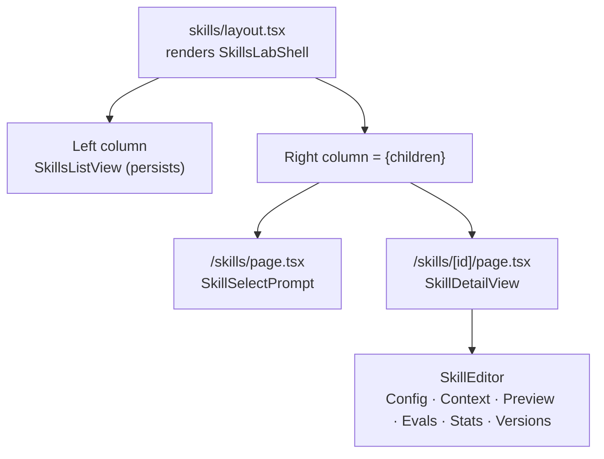

# `@devdigest/web` — the studio (Next.js 15)

The DevDigest UI: import repos, browse pull requests, run and read AI reviews,
and author agents. App Router + React Server/Client components, data via
**TanStack Query** hooks over the Fastify API. (This is the starter surface;
course lessons add the Skills, Memory, Eval, Blast/Brief, multi-agent, CI, and
dashboard screens.)

- **Stack:** Next.js 15 (App Router), React 19, TanStack Query, `next-intl`
  (messages in `messages/<locale>/*.json`), `recharts`, `mermaid`,
  `react-markdown`. UI primitives are vendored under `src/vendor/ui`
  (`@devdigest/ui`) and shared Zod contracts under `src/vendor/shared`
  (`@devdigest/shared`).
- **API base:** `NEXT_PUBLIC_API_BASE` (default `http://localhost:3001`), used by
  `src/lib/api.ts`. Every data hook lives in `src/lib/hooks/*`.
- **Run:** `pnpm dev` (`:3000`). **Test:** `pnpm test` (vitest + jsdom, fetch
  mocked — no API needed). **Typecheck:** `pnpm typecheck`.

## UI route map

Routes (`src/app/**/page.tsx`) and the API surface each leans on (via
`src/lib/hooks/*` → `src/lib/api.ts`):

Cross-cutting chrome lives in `src/components/app-shell` (nav, breadcrumbs,
`g`-then-key shortcuts). Pages are thin; feature logic sits in colocated
`_components/<Name>/` folders, each with its own `*.test.tsx`.

The Diff tab (`DiffTab`) defaults to `SmartDiffViewer` (`.../pulls/[number]/_components/SmartDiffViewer/`),
which groups files by risk via `/pulls/:id/smart-diff`, draws each PR finding
as a chip on its diff line (clicking one jumps to that finding's card in the
Agent runs tab), and falls back to the plain diff-viewer on any fetch error.
A header toggle swaps to `Original order`, the unranked plain diff with no
annotations — see [`../docs/smart-diff.md`](../docs/smart-diff.md).

The Overview tab (`OverviewTab.tsx`) lays out three horizontal regions in DOM
order, SPEC-04 follow-up AC-56/AC-69: region 1 is `PrBriefCard`
(`.../pulls/[number]/_components/PrBriefCard/`) at full width; region 2 is the
existing `IntentCard` | `BlastTab` pair, the only `auto-fit` grid on the tab
(`OverviewTab/constants.ts`'s `OVERVIEW_GRID_COLS`, a 420px-per-card floor,
AC-57/AC-58); region 3 is `ReviewFocusPanel`
(`.../pulls/[number]/_components/ReviewFocusPanel/`) at full width, rendered
only once a brief is actually loaded — not during the initial load, not on a
load error, not before the first generation (AC-63). While a regenerate is
pending, region 3 keeps showing the previous `review_focus[]` list, since the
underlying query doesn't touch its cached data until the mutation resolves
(AC-66).

Both regions read the brief through one call site: `usePrBriefSection(prId)`
(`src/lib/hooks/brief.ts`) composes `useBrief`/`useGenerateBrief`/
`usePrReviews` into a single view model that `OverviewTab` reads once and
hands down as props to both regions — splitting the card into two regions adds
no second network request or independent loading/error state (AC-62).
`PrBriefCard`'s states are empty (`brief === null`, a Generate CTA), loading,
error (Retry, previous brief still on screen), and stale (`brief.stale`, a
badge next to the Regenerate button) — a second click while a generation is
pending is a no-op (`generate.isPending` disables the button). **The score
shown in `PrBriefCard` is read independently**, from `usePrReviews`'s newest
row with `kind === 'review'` — never from the brief response — so
regenerating the brief never moves the score, and a new agent run never
regenerates the brief. It renders as
`<CircularScore score={score} size={34} stroke={3} />`, the same vendored
primitive and dimensions as the PR list's score column (`PRRow.tsx`); when
there is no score yet the donut doesn't render at all, just the muted "not yet
reviewed" text (AC-48, AC-68).

`ReviewFocusPanel` carries only the Review Focus header (with a shown-item
count) and the `review_focus[]` list — no Regenerate button, no stale badge,
no generation error; those stay in `PrBriefCard` (AC-61, AC-65, AC-67). Its
rows render as real `<button>`s only for paths present in the PR's current
file list (`navigablePaths`, computed in `page.tsx` from `pr.files`);
activating one calls `onOpenFile`, which writes `?tab=diff&file=<path>` in a
single `setParams` update and hands `DiffTab` a `targetPath` that expands and
scrolls to that file (`targetFileMeta`, `SmartDiffViewer/helpers.ts` — the
sole owner of a file's `defaultOpen` override, so `DiffTab` renders the flat
`DiffViewer` directly instead of `SmartDiffViewer` whenever a target is set).
The URL alone drives this: reloading `?tab=diff&file=…` reproduces the same
expanded file. A Review Focus row's `line` is never part of this navigation —
the contract carries it as reason text only, since blast-derived line numbers
resolve against the index's `indexed_sha`, not the PR's `head_sha`.

`/repos/:repoId/context` (`ProjectContextView`) is a read-only list + search +
markdown preview of the active repo's docs (`GET /repos/:id/context`) — no
`Edit`/`Save`/`+`/upload. Attaching docs to an agent or a skill goes through
the shared `src/components/context-doc-picker/`, mounted in the agent editor's
**Context** tab (`?tab=context`, `GET|POST /agents/:id/context`) and the skill
editor's own **Context** tab (`?tab=context`, same `GET|POST
/skills/:id/context`) — both mount the identical picker barrel; both
set-write the whole ordered path list, optimistically, with a rollback to the
server's order on failure. A skill's attached docs are inherited by every
agent that has that skill enabled — see server's [Review context
(non-obvious)](../server/README.md#review-context-non-obvious). The run
trace's Prompt assembly section renders the resulting block under the caption
`Project context — attached specs (untrusted)`.

`/repos/:repoId/onboarding` (`OnboardingTourView`, sidebar "Onboarding Tour",
shortcut `g o`) is a five-section, read-only first-day tour of the active
repo — architecture overview, critical paths, run locally, reading path,
first tasks — generated by an explicit `Generate`/`Regenerate` action, never
automatically on open (`useOnboardingTour` / `useGenerateOnboardingTour`,
`src/lib/hooks/onboarding.ts`). Three states off `GET /repos/:id/onboarding`:
an **empty** pre-generation state (`generated_at: null`) shows a `Generate`
CTA; a **skeleton** (`status: 'skeleton'`) shows a reason-specific empty state
with the same CTA relabelled "Try again"; a **ready** tour renders all five
cards plus a scroll-spy "ON THIS PAGE" table of contents, a `Share link`
button (copies the current URL), and per-section `Open on GitHub` links for
`critical_paths` and `architecture_overview` file references
(`OPEN_LINK_KINDS`). `run_locally` renders its links as copyable shell
commands instead (`CommandRow`), never as `Open` links. `POST
/repos/:id/onboarding/generate` always sends `{ locale }` from the active
UI locale; on response the mutation writes straight into the query cache so a
skeleton result renders immediately, then invalidates the query so a `ready`
result refetches what the server actually persisted.

`/eval` (`EvalOverview`, sidebar "Eval Dashboard", SKILLS LAB group, last item,
no `g`-chord — `src/vendor/ui/nav.ts`) lists every agent with a non-empty
eval-case set as one full-width row (`AgentRow`, `_components/AgentRow/`) off
`GET /eval/overview` (the response is already filtered to `owner_kind='agent'`
and non-empty sets, so the component never re-filters `data.agents`) — not the
card grid this section used to describe. Each row is a square icon tile, the
agent's bold name plus a mono model badge, a `Last run v<N> ·
<YYYY-MM-DD HH:mm> · X/Y pass` meta line, a `recall` sparkline drawn only once
the agent has at least two trend points (below that the vendored `Sparkline`
would divide by zero on a single point), three `RECALL`/`PREC`/`CITE` stat
blocks that always print the percentage (colour is additive, never the sole
carrier), and a decorative `aria-hidden` chevron; the whole row is exactly one
focusable `next/link` to `/eval/:agentId`. `last_batch === null` is the sole
"never run" discriminant — it renders the badge, `—` for all three stats and
no sparkline; an agent can legitimately have a non-null `last_batch` and an
empty `trend` (every batch it ran measured nothing), so an empty trend alone
must never be read as "never run". Below the rows, a newest-first table of
every batch across every agent, columns agent → time → version → recall →
precision → citation → pass → cost: the agent name is plain text, the batch
version (`v<N>`) is the table's only link (to `/eval/:agentId`), and each
metric renders as a horizontal bar plus the always-printed percentage.

The header's accent `Run all agents` button opens a confirmation dialog
(`RunAllDialog`) naming how many agents and how many eval cases in total will
run; only once the human confirms does it fan out one `POST
/agents/:id/eval-runs` call per agent with a non-empty set, sequentially
(`useRunAllAgentEvalBatches`, `src/lib/hooks/eval.ts`) — the same endpoint the
agent editor's own **Evals** tab (`?tab=evals`,
`AgentEditor/_components/EvalsTab/`) already calls to run a single agent.
Nothing runs before that confirmation, a run costs real model budget, and one
agent failing (a provider error, a timeout, or 409 `no_provider_key`) does not
stop the rest of the fan-out — the failing agent is reported with its reason
instead of showing a batch. The button disables itself with a textual reason
while no agent has cases and while a run is already in progress, and stays
disabled once every attempted agent has failed with `no_provider_key`.
`/eval/:agentId` (`AgentDashboard`) is one agent's dashboard off `GET
/eval/dashboard?owner_id=<agentId>`: current-value metric tiles with a delta
against the previous batch (omitted, not zeroed, on the very first batch), a
regression banner when the response's `alert` is non-null, a
recall/precision/citation-accuracy trend chart, and a batches table where
selecting exactly two rows enables `Compare`.

The agent editor's own **Evals** tab (`/agents/:id?tab=evals`,
`AgentEditor/_components/EvalsTab/`) lists that agent's own case set — name,
a last-run outcome badge (`passed`/`failed`/`errored`/`never run`, read from
`EvalDashboard.recent_runs` via `latestRunByCase`), the existing icon+count
expectation badge — plus, additively, the case's stored `expectation_kind`
printed in words (`must_find`/`must_not_flag`, `expectationKindOf()`, which
falls back to deriving it from `expected_output` only for a case written
before the kind existed) and a text warning when that stored kind disagrees
with the case's current `expected_output` (`expectationMismatch()`); neither
addition replaces the existing badge or icon. Selecting `New case` or a row's
`Edit` opens `EvalCaseModal` (`_components/EvalCaseModal/`) for create/edit,
whose subtitle names the case's origin from `caseOrigin()`
(`source_finding_id` plus the stored kind) — `Seeded from an accepted
finding · assert the expected output`, `Seeded from a dismissed finding ·
assert the expected output`, or `Created by hand · assert the expected
output` — and whose form is topped by a words-not-colour banner driven by
that same stored kind: `POSITIVE CASE` with one `MUST find "<title>" at
<file>:<line>` line per expected finding (the case's own name in place of
`<title>` when a finding carries none), or `NEGATIVE CASE` with `MUST NOT
flag`; colour is additive only, never the sole carrier. Below the diff/JSON
fields, an `Actual output` panel reads `Never run yet` when the case has no
run at all (never a zero-filled metrics object read as a result), otherwise a
pass/fail label, the three percentage metrics plus duration, and the model's
own findings from that run as escaped text — or, on a failed run, only the
failure reason, never the diff. The footer's `Run case` button spends exactly
one model call against `POST /agents/:id/eval-cases/:caseId/run`
(`useRunAgentEvalCase`, `src/lib/hooks/eval.ts`; disabled while pending, on an
unsaved case, or when the agent has no provider key configured), and a `Run
on save` toggle — off every time the modal opens, never persisted — fires
that same run only after a save succeeds, keeping the modal open afterwards
so the result stays visible (a failed save never triggers a run). The
vendored `Toggle` has no `disabled` prop, so the no-provider-key state is a
guarded `onChange` plus an `aria-disabled` wrapper carrying the same textual
reason the `Run case` button shows, not a `disabled` attribute. A run made
this way is persisted outside any batch (`batch_id: null`, server-side) and
so never moves the trend, sparkline or regression banner described above —
its only visible effect is this case's own row and the panel that just ran
it.

### Skills Lab (`/skills`, master-detail)

`/skills` and `/skills/:id` share one nested `src/app/skills/layout.tsx` — the
app's first nested layout — which renders `SkillsLabShell`
(`src/app/skills/_components/SkillsLabShell/`): the `AppShell` chrome,
breadcrumbs, the search box, the `+ Add Skill` menu, and the left list column
all live there, so they persist across a selection instead of remounting with
it. Each route's own thin `page.tsx` renders only the right column's content —
a "select a skill" prompt at `/skills`, `SkillDetailView` (header, `Run on
evals`, `Delete skill`, then the tabbed `SkillEditor`) at `/skills/:id`.
Selecting a card is one navigation to `/skills/<id>?tab=<current tab>`, built
from a single `URLSearchParams` mutation, so the URL stays the sole source of
truth for "which skill" and "which tab". The old side-preview pane and its
`Open in the editor` button are gone — picking a card is the only path into a
skill's details.

The editor has six tabs — `Config`, `Context`, `Preview`, `Evals`, `Stats`,
`Versions` (`SkillEditor/constants.ts`) — `Context` mounts the same
`context-doc-picker` barrel described above. Two cross-route seams tie the
shell to the editor: `SkillDirtyGate`
(`src/app/skills/_components/SkillDirtyGate/`) lets `ConfigTab` register its
unsaved-changes flag with the shell, which shows a "Discard unsaved changes?"
confirmation before switching the selected skill (never on a same-skill tab
switch — the `Config` pane is hidden, not unmounted, so its draft survives);
`SkillEvalRun` (`src/app/skills/[id]/_components/SkillEvalRun/`) is the one
owner of eval-run state shared between the header's `Run on evals` button and
the `Evals` tab's `Run all`, both firing the same `POST /skills/:id/eval-run`.
Below 1024px the shell collapses to a single column with a back-to-list link,
driven by `useMediaQuery` (`src/lib/use-media-query.ts`), an SSR-safe hook
that defaults to "wide" until the client subscribes to `matchMedia`.

## Testing

Component/interaction tests (`*.test.tsx`) run under vitest + jsdom with `fetch`
mocked, so they need neither the API nor a browser. The real browser journeys
(client + API + seeded DB) are covered by the deterministic agent-browser suite
in [`../e2e`](../e2e/README.md) and the `e2e-web.yml` workflow. See
[`../TESTING.md`](../TESTING.md).
