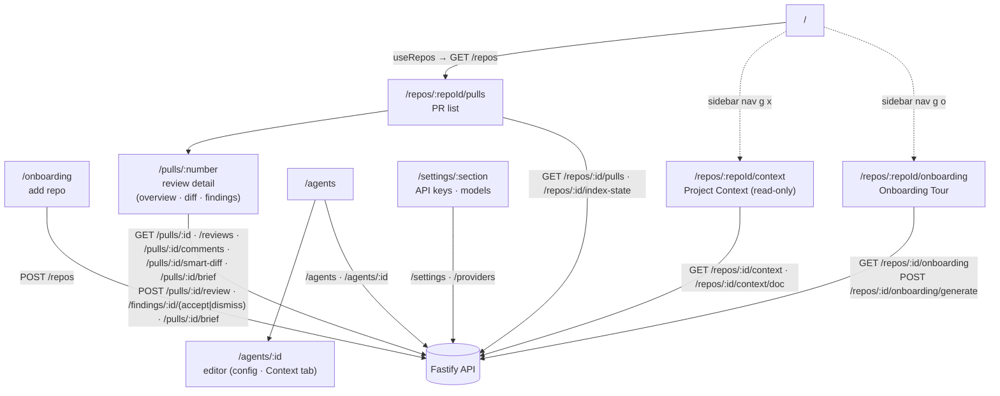
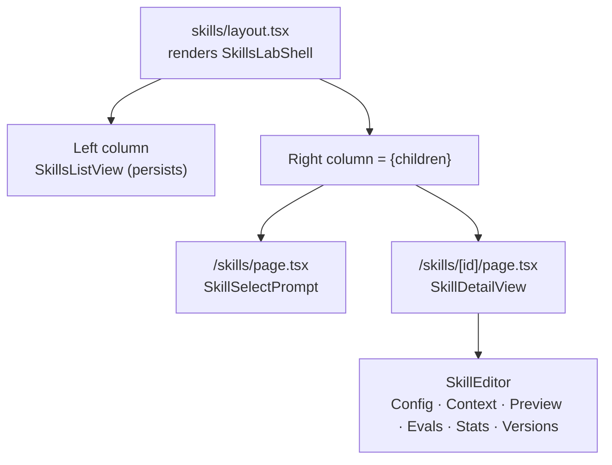

# `@devdigest/web` — the studio (Next.js 15)

The DevDigest UI: import repos, browse pull requests, run and read AI reviews,
and author agents. App Router + React Server/Client components, data via
**TanStack Query** hooks over the Fastify API. (This is the starter surface;
course lessons add the Skills, Memory, Eval, Blast/Brief, multi-agent, CI, and
dashboard screens.)

- **Stack:** Next.js 15 (App Router), React 19, TanStack Query, `next-intl`
  (messages in `messages/<locale>/*.json`), `recharts`, `mermaid`,
  `react-markdown`. UI primitives are vendored under `src/vendor/ui`
  (`@devdigest/ui`) and shared Zod contracts under `src/vendor/shared`
  (`@devdigest/shared`).
- **API base:** `NEXT_PUBLIC_API_BASE` (default `http://localhost:3001`), used by
  `src/lib/api.ts`. Every data hook lives in `src/lib/hooks/*`.
- **Run:** `pnpm dev` (`:3000`). **Test:** `pnpm test` (vitest + jsdom, fetch
  mocked — no API needed). **Typecheck:** `pnpm typecheck`.

## UI route map

Routes (`src/app/**/page.tsx`) and the API surface each leans on (via
`src/lib/hooks/*` → `src/lib/api.ts`):

Cross-cutting chrome lives in `src/components/app-shell` (nav, breadcrumbs,
`g`-then-key shortcuts). Pages are thin; feature logic sits in colocated
`_components/<Name>/` folders, each with its own `*.test.tsx`.

The Diff tab (`DiffTab`) defaults to `SmartDiffViewer` (`.../pulls/[number]/_components/SmartDiffViewer/`),
which groups files by risk via `/pulls/:id/smart-diff`, draws each PR finding
as a chip on its diff line (clicking one jumps to that finding's card in the
Agent runs tab), and falls back to the plain diff-viewer on any fetch error.
A header toggle swaps to `Original order`, the unranked plain diff with no
annotations — see [`../docs/smart-diff.md`](../docs/smart-diff.md).

`PrBriefCard` (`.../pulls/[number]/_components/PrBriefCard/`) is the Overview
tab's third card (SPEC-04), sitting beside the existing `IntentCard` and
`BlastTab` without changing either. `useBrief`/`useGenerateBrief`
(`src/lib/hooks/brief.ts`) read/write `GET`/`POST /pulls/:id/brief`; the
card's states are empty (`brief === null`, a Generate CTA), loading, error
(Retry, previous brief still on screen), and stale (`brief.stale`, a badge
next to the Regenerate button) — a second click while a generation is pending
is a no-op (`generate.isPending` disables the button). **The score shown next
to the brief is read independently**, from `usePrReviews`'s newest row with
`kind === 'review'` — never from the brief response — so regenerating the
brief never moves the score, and a new agent run never regenerates the brief.
Review Focus rows render as real `<button>`s only for paths present in the
PR's current file list (`navigablePaths`, computed in `page.tsx` from
`pr.files`); activating one calls `onOpenFile`, which writes
`?tab=diff&file=<path>` in a single `setParams` update and hands `DiffTab` a
`targetPath` that expands and scrolls to that file (`targetFileMeta`,
`SmartDiffViewer/helpers.ts` — the sole owner of a file's `defaultOpen`
override, so `DiffTab` renders the flat `DiffViewer` directly instead of
`SmartDiffViewer` whenever a target is set). The URL alone drives this:
reloading `?tab=diff&file=…` reproduces the same expanded file. A Review
Focus row's `line` is never part of this navigation — the contract carries it
as reason text only, since blast-derived line numbers resolve against the
index's `indexed_sha`, not the PR's `head_sha`.

`/repos/:repoId/context` (`ProjectContextView`) is a read-only list + search +
markdown preview of the active repo's docs (`GET /repos/:id/context`) — no
`Edit`/`Save`/`+`/upload. Attaching docs to an agent or a skill goes through
the shared `src/components/context-doc-picker/`, mounted in the agent editor's
**Context** tab (`?tab=context`, `GET|POST /agents/:id/context`) and the skill
editor's own **Context** tab (`?tab=context`, same `GET|POST
/skills/:id/context`) — both mount the identical picker barrel; both
set-write the whole ordered path list, optimistically, with a rollback to the
server's order on failure. A skill's attached docs are inherited by every
agent that has that skill enabled — see server's [Review context
(non-obvious)](../server/README.md#review-context-non-obvious). The run
trace's Prompt assembly section renders the resulting block under the caption
`Project context — attached specs (untrusted)`.

`/repos/:repoId/onboarding` (`OnboardingTourView`, sidebar "Onboarding Tour",
shortcut `g o`) is a five-section, read-only first-day tour of the active
repo — architecture overview, critical paths, run locally, reading path,
first tasks — generated by an explicit `Generate`/`Regenerate` action, never
automatically on open (`useOnboardingTour` / `useGenerateOnboardingTour`,
`src/lib/hooks/onboarding.ts`). Three states off `GET /repos/:id/onboarding`:
an **empty** pre-generation state (`generated_at: null`) shows a `Generate`
CTA; a **skeleton** (`status: 'skeleton'`) shows a reason-specific empty state
with the same CTA relabelled "Try again"; a **ready** tour renders all five
cards plus a scroll-spy "ON THIS PAGE" table of contents, a `Share link`
button (copies the current URL), and per-section `Open on GitHub` links for
`critical_paths` and `architecture_overview` file references
(`OPEN_LINK_KINDS`). `run_locally` renders its links as copyable shell
commands instead (`CommandRow`), never as `Open` links. `POST
/repos/:id/onboarding/generate` always sends `{ locale }` from the active
UI locale; on response the mutation writes straight into the query cache so a
skeleton result renders immediately, then invalidates the query so a `ready`
result refetches what the server actually persisted.

### Skills Lab (`/skills`, master-detail)

`/skills` and `/skills/:id` share one nested `src/app/skills/layout.tsx` — the
app's first nested layout — which renders `SkillsLabShell`
(`src/app/skills/_components/SkillsLabShell/`): the `AppShell` chrome,
breadcrumbs, the search box, the `+ Add Skill` menu, and the left list column
all live there, so they persist across a selection instead of remounting with
it. Each route's own thin `page.tsx` renders only the right column's content —
a "select a skill" prompt at `/skills`, `SkillDetailView` (header, `Run on
evals`, `Delete skill`, then the tabbed `SkillEditor`) at `/skills/:id`.
Selecting a card is one navigation to `/skills/<id>?tab=<current tab>`, built
from a single `URLSearchParams` mutation, so the URL stays the sole source of
truth for "which skill" and "which tab". The old side-preview pane and its
`Open in the editor` button are gone — picking a card is the only path into a
skill's details.

The editor has six tabs — `Config`, `Context`, `Preview`, `Evals`, `Stats`,
`Versions` (`SkillEditor/constants.ts`) — `Context` mounts the same
`context-doc-picker` barrel described above. Two cross-route seams tie the
shell to the editor: `SkillDirtyGate`
(`src/app/skills/_components/SkillDirtyGate/`) lets `ConfigTab` register its
unsaved-changes flag with the shell, which shows a "Discard unsaved changes?"
confirmation before switching the selected skill (never on a same-skill tab
switch — the `Config` pane is hidden, not unmounted, so its draft survives);
`SkillEvalRun` (`src/app/skills/[id]/_components/SkillEvalRun/`) is the one
owner of eval-run state shared between the header's `Run on evals` button and
the `Evals` tab's `Run all`, both firing the same `POST /skills/:id/eval-run`.
Below 1024px the shell collapses to a single column with a back-to-list link,
driven by `useMediaQuery` (`src/lib/use-media-query.ts`), an SSR-safe hook
that defaults to "wide" until the client subscribes to `matchMedia`.

## Testing

Component/interaction tests (`*.test.tsx`) run under vitest + jsdom with `fetch`
mocked, so they need neither the API nor a browser. The real browser journeys
(client + API + seeded DB) are covered by the deterministic agent-browser suite
in [`../e2e`](../e2e/README.md) and the `e2e-web.yml` workflow. See
[`../TESTING.md`](../TESTING.md).
