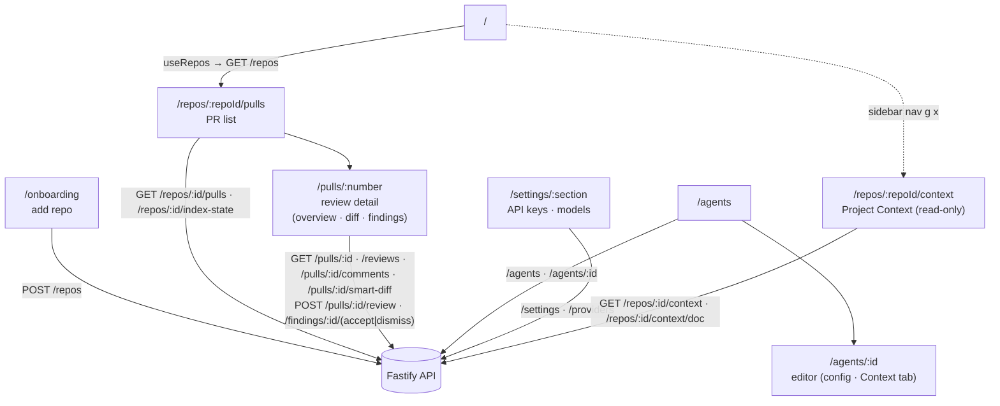

# `@devdigest/web` — the studio (Next.js 15)

The DevDigest UI: import repos, browse pull requests, run and read AI reviews,
and author agents. App Router + React Server/Client components, data via
**TanStack Query** hooks over the Fastify API. (This is the starter surface;
course lessons add the Skills, Memory, Eval, Blast/Brief, multi-agent, CI, and
dashboard screens.)

- **Stack:** Next.js 15 (App Router), React 19, TanStack Query, `next-intl`
  (messages in `messages/<locale>/*.json`), `recharts`, `mermaid`,
  `react-markdown`. UI primitives are vendored under `src/vendor/ui`
  (`@devdigest/ui`) and shared Zod contracts under `src/vendor/shared`
  (`@devdigest/shared`).
- **API base:** `NEXT_PUBLIC_API_BASE` (default `http://localhost:3001`), used by
  `src/lib/api.ts`. Every data hook lives in `src/lib/hooks/*`.
- **Run:** `pnpm dev` (`:3000`). **Test:** `pnpm test` (vitest + jsdom, fetch
  mocked — no API needed). **Typecheck:** `pnpm typecheck`.

## UI route map

Routes (`src/app/**/page.tsx`) and the API surface each leans on (via
`src/lib/hooks/*` → `src/lib/api.ts`):

Cross-cutting chrome lives in `src/components/app-shell` (nav, breadcrumbs,
`g`-then-key shortcuts). Pages are thin; feature logic sits in colocated
`_components/<Name>/` folders, each with its own `*.test.tsx`.

The Diff tab (`DiffTab`) defaults to `SmartDiffViewer` (`.../pulls/[number]/_components/SmartDiffViewer/`),
which groups files by risk via `/pulls/:id/smart-diff`, draws each PR finding
as a chip on its diff line (clicking one jumps to that finding's card in the
Agent runs tab), and falls back to the plain diff-viewer on any fetch error.
A header toggle swaps to `Original order`, the unranked plain diff with no
annotations — see [`../docs/smart-diff.md`](../docs/smart-diff.md).

`/repos/:repoId/context` (`ProjectContextView`) is a read-only list + search +
markdown preview of the active repo's docs (`GET /repos/:id/context`) — no
`Edit`/`Save`/`+`/upload. Attaching docs to an agent or a skill goes through
the shared `src/components/context-doc-picker/`, mounted in the agent editor's
**Context** tab (`?tab=context`, `GET|POST /agents/:id/context`) and the skill
editor's **Project context to use** section (`GET|POST /skills/:id/context`);
both set-write the whole ordered path list, optimistically, with a rollback to
the server's order on failure. A skill's attached docs are inherited by every
agent that has that skill enabled — see server's [Review context
(non-obvious)](../server/README.md#review-context-non-obvious). The run
trace's Prompt assembly section renders the resulting block under the caption
`Project context — attached specs (untrusted)`.

## Testing

Component/interaction tests (`*.test.tsx`) run under vitest + jsdom with `fetch`
mocked, so they need neither the API nor a browser. The real browser journeys
(client + API + seeded DB) are covered by the deterministic agent-browser suite
in [`../e2e`](../e2e/README.md) and the `e2e-web.yml` workflow. See
[`../TESTING.md`](../TESTING.md).
