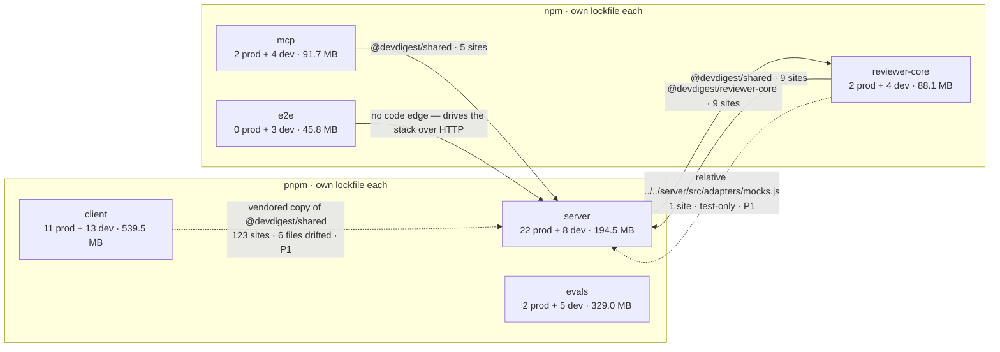

# Dependency report — 2026-08-24

Node v22.23.1 · 6 packages · 962 resolved dependency instances · 1.26 GB on disk
Findings: **2 P0 · 6 P1 · 7 P2 · 5 Info**

## Scope

All six packages were analysed. Every number below was **measured** by
`node scripts/deps-report.mjs --json` (offline lanes only — `--outdated` and
`--audit` were **not** run, so this report contains no advisory and no
"behind by N majors" data). Sizes are apparent file bytes in each package's own
`node_modules`, in MiB; `server/clones` (7.0 MB of runtime checkouts) is outside
every dependency tree and is not counted anywhere here.

Every claim marked *confirmed* was re-checked by hand against source after the
collector produced it; the collector's mechanical findings that did **not**
survive that check are listed under Info as false positives, not silently dropped.

| Package | Manager | Lockfile |
|---|---|---|
| `server` (@devdigest/api) | pnpm | `server/pnpm-lock.yaml` |
| `client` (@devdigest/web) | pnpm | `client/pnpm-lock.yaml` |
| `evals` (@devdigest/evals) | pnpm | `evals/pnpm-lock.yaml` |
| `reviewer-core` (@devdigest/reviewer-core) | npm | `reviewer-core/package-lock.json` |
| `e2e` (@devdigest/e2e) | npm | `e2e/package-lock.json` |
| `mcp` (@devdigest/mcp) | npm | `mcp/package-lock.json` |

These are **six independent packages, not a workspace**: six `package.json`
files, six lockfiles, two package managers, no `workspace:*` links and no
hoisted root `node_modules`. They share code exclusively through TypeScript path
aliases resolved by each `tsconfig.json`. Two consequences run through the whole
report — one library is installed once *per package* (so one version bump is up
to six edits), and an internal edge taken by a relative path instead of an alias
bypasses the target package's public entry point.

## Dependency graph

Internal edges are path aliases. Nothing on an edge is installed from a registry.

`client` has **no** alias edge to `server`: its `@devdigest/shared` resolves to
its own `client/src/vendor/shared/index.ts`, a hand-maintained copy. The dotted
edge is that copy relationship, not an import.

## Size & weight

*Exclusive size* is what disappears if the dependency goes — its subtree minus
everything another dependency also pulls in. It is why the rows below do not sum
to the package totals.

| Package | Dependency | Type | Version | Exclusive size | Import sites |
|---|---|---|---|---:|---:|
| `evals` | `@anthropic-ai/claude-agent-sdk` | prod | 0.3.198 | 248.9 MB | 1 |
| `client` | `mermaid` | prod | 11.15.0 | 117.3 MB | 1 (lazy `await import`) |
| `server` | `drizzle-kit` | dev | 0.30.6 | 30.0 MB | CLI only |
| `client` | `lucide-react` | prod | 0.469.0 | 28.6 MB | 1 (icon re-export registry) |
| *(each package)* | `typescript` | dev | 5.9.3 | 23.6 MB ×6 | CLI only |
| `server` | `js-tiktoken` | prod | 1.0.21 | 22.4 MB | 1 |
| *(five packages)* | `tsx` | dev | 4.22.4 / 4.23.12 | ~22 MB ×5 | CLI only |
| `client` | `@tailwindcss/postcss` | dev | 4.3.0 | 14.7 MB | config |
| `client` | `recharts` | prod | 2.15.4 | 9.9 MB | 2 |
| `mcp` | `@modelcontextprotocol/sdk` | prod | 1.30.0 | 9.0 MB | 10 |
| `reviewer-core` | `openai` | prod | 4.104.0 | 8.4 MB | 2 |
| `server` | `drizzle-orm` | prod | 0.38.4 | 8.2 MB | 49 |
| `server` | `@ast-grep/napi` | prod | 0.43.0 | 7.4 MB | 1 |
| `server` | `@vscode/ripgrep` | prod | 1.18.0 | 4.5 MB | — |
| `server` | `dependency-cruiser` | **prod** | 17.4.3 | 4.2 MB | CLI only |

### Per-package totals

| Package | Resolved | Prod-reachable | Dev-only | Prod size | Dev-only size | On disk | Unattributed |
|---|---:|---:|---:|---:|---:|---:|---:|
| `client` | 390 | 246 | 144 | 446.4 MB | 63.4 MB | **539.5 MB** | 29.7 MB |
| `evals` | 143 | 76 | 67 | 251.9 MB | 51.3 MB | **329.0 MB** | 25.8 MB |
| `server` | 279 | 144 | 135 | 72.6 MB | 72.3 MB | **194.5 MB** | 49.6 MB |
| `mcp` | 71 | 33 | 38 | 12.0 MB | 52.2 MB | **91.7 MB** | 27.6 MB |
| `reviewer-core` | 72 | 40 | 32 | 13.8 MB | 50.4 MB | **88.1 MB** | 23.9 MB |
| `e2e` | 7 | 0 | 7 | 0 | 45.8 MB | **45.8 MB** | 0 |
| **total** | **962** | | | | | **1 288.7 MB** | **156.6 MB** |

*Unattributed* is on disk but outside the resolved tree — optional platform
binaries, peer installs and stale copies.

### What six lockfiles cost

211 distinct libraries are installed in more than one package. Summed, the
redundant copies are **378.5 MB — 29 % of everything on disk**:

| Library | Packages | Versions installed | Redundant |
|---|---:|---|---:|
| `typescript` | 6 | 5.9.3 (one version) | 112.7 MB |
| `@esbuild/darwin-arm64` | 6 | 0.18.20 → 0.28.2 (6) | 96.2 MB |
| `esbuild` | 6 | 0.18.20 → 0.28.2 (6) | 50.3 MB |
| `@types/node` | 6 | 18.19.130 + five 22.x | 17.9 MB |
| `zod` | 5 | 3.25.76, 4.4.3 | 13.7 MB |
| `vite` | 5 | 5.4.21, 8.2.1 | 11.6 MB |
| `rollup` · `@rollup/rollup-darwin-arm64` | 4 | 4.61.0, 4.61.1, 4.62.2 | 13.2 MB |
| `openai` | 3 | 4.104.0 (one version) | 8.1 MB |
| `vitest` | 5 | 2.1.9, 4.1.10 | 6.3 MB |

This is a property of the chosen layout, not a defect — it is listed so the
number is on the record before anyone proposes a workspace migration.

## Internal dependencies

Nothing in this section is installed; every edge is a `tsconfig.json` path alias.

| From | To | Alias | Target | Import sites |
|---|---|---|---|---:|
| `server` | `server` | `@devdigest/shared` | `server/src/vendor/shared/index.ts` | 97 |
| `server` | `reviewer-core` | `@devdigest/reviewer-core` | `reviewer-core/src/index.ts` | 9 |
| `reviewer-core` | `server` | `@devdigest/shared` | `server/src/vendor/shared/index.ts` | 9 |
| `mcp` | `server` | `@devdigest/shared` | `server/src/vendor/shared/index.ts` | 5 |
| `client` | `client` | `@devdigest/shared` | `client/src/vendor/shared/index.ts` | 123 |
| `client` | `client` | `@devdigest/ui` | `client/src/vendor/ui/index.ts` | 88 |
| `client` | `client` | `@/*` | `client/src/*` | 100 |

**One boundary bypass.** `reviewer-core/test/run.test.ts:3` imports
`../../server/src/adapters/mocks.js` by relative path. No alias covers
`server/src/adapters`, so the relative path is currently the only route — which
is precisely why it is a finding rather than a style nit: it reaches past
`@devdigest/shared` into another package's adapter internals.

**The `@devdigest/shared` mirror.** 12 files on each side, none missing on either
side, **6 files differing**. Characterised by hand:

| File | Non-comment diff lines | What differs |
|---|---:|---|
| `contracts/knowledge.ts` | 22 | server-only `OnboardingGenerateBody`, `AgentVersion*` — deliberate trim |
| `contracts/eval-ci.ts` | 18 | server-only `AgentManifest` (trim) **plus** `ConformanceInput.provider` missing `'openrouter'` on the client |
| `adapters.ts` | 17 | server-only surface — trim |
| `contracts/platform.ts` | 4 | `FEATURE_MODELS.review_intent` — server `openrouter`/`deepseek-v4-flash`, client `openai`/`gpt-4.1` |
| `contracts/productionize.ts` | 2 | comment wording |
| `contracts/trace.ts` | 1 | comment wording |

`Provider` itself (`knowledge.ts:408` server / `:381` client) is identical on both
sides and does include `'openrouter'`. The two substantive divergences are in
`platform.ts` and `eval-ci.ts` — see P1-3.

## Findings & Priorities

### P0 — 2

**P0-1 · `vitest` is declared at two majors across the repo.**
`mcp/package.json` `^4.1.10` (resolves 4.1.10) against `client`, `reviewer-core`,
`server` `^2.1.8` and `evals` `^2.1.0` (all resolve 2.1.9). The split has already
propagated: `mcp` pulls `vite` 8.2.1 while every other package is on 5.4.21, and
the two vitest trees cost 6.3 MB of duplication. `scripts/verify.mjs` drives all
of these lanes from one entry point, so a config option valid in one lane is not
valid in another. *Direction:* decide whether `mcp` on v4 is deliberate isolation
(then say so in `mcp/AGENTS.md`) or drift, and align the other four either way.
Nothing crosses the wire here, so this is a CI/tooling break rather than a
runtime bug — it is P0 because a second major of a self-declared library is a
contradiction in the graph, and the upgrade cost only grows.

**P0-2 · `dependency-cruiser` is declared at two majors.**
`server/package.json` `^17.4.3` against `client/package.json` `^18.1.1`. Two
config files, `server/.dependency-cruiser.cjs` and
`client/.dependency-cruiser.cjs`, each cruised by its own package's CLI — and
the server config also cruises `reviewer-core/src`, so one v17 binary enforces
the boundaries of two packages. A rule schema change between 17 and 18 breaks
one config silently. *Direction:* bring both to 18 in one PR and re-run
`node scripts/verify.mjs --slice backend` and `--slice frontend`. See also P1-2:
the server copy is in the wrong dependency block.

### P1 — 6

**P1-1 · `@fastify/autoload` is a production dependency nothing uses.**
`server/package.json` → `dependencies` → `@fastify/autoload` 6.3.1, 171 KB, zero
imports in `server/src`. *Confirmed:* `server/src/modules/index.ts:24` documents
the opposite decision — modules are registered explicitly "rather than via
filesystem autoload so the same code path works under tsx". *Direction:* remove
it outright; this is not a move-to-dev case.

**P1-2 · `dependency-cruiser` ships in production.**
`server/package.json` → `dependencies` → `dependency-cruiser` 17.4.3, 4.2 MB.
It is build/test tooling run from a package script and is in `devDependencies`
on the client side. Every production install of `server` carries it.
*Direction:* move to `devDependencies` (do it in the same PR as P0-2).

**P1-3 · The client mirror of `@devdigest/shared` missed the OpenRouter change.**
Root cause is one commit — `9b6f821 feat(evals): harness eval package +
OpenRouter engine` — landing on the server copy only. Two files:
- `client/src/vendor/shared/contracts/platform.ts` — `FEATURE_MODELS.review_intent`
  still reads `openai` / `gpt-4.1`; the server copy reads `openrouter` /
  `deepseek/deepseek-v4-flash`. *Confirmed:* the client never reads this value —
  `SettingsModels.tsx:9` imports `FEATURE_MODELS` from `client/src/lib/feature-models.ts`,
  a **third** copy of the same registry which does agree with the server. So the
  vendored copy is stale *and* dead, which is the worst combination: it will be
  believed by the next person who greps for it.
- `client/src/vendor/shared/contracts/eval-ci.ts:220` — `ConformanceInput.provider`
  is `z.enum(['openai','anthropic'])`; the server has the same field with
  `'openrouter'` added. *Confirmed:* neither side has a live consumer today
  (`ConformanceInput` is referenced nowhere outside its own definition in either
  package), so the drift is latent, not breaking.

*Direction:* re-mirror both files from the server copy, and separately decide
whether `client/src/lib/feature-models.ts` or the vendored `platform.ts` is the
client's single source — three copies of one registry is one too many.
`AGENTS.md` already names this mirror as a standing hazard; this is it firing.

**P1-4 · A relative import crosses a package boundary.**
`reviewer-core/test/run.test.ts:3` → `../../server/src/adapters/mocks.js`, reaching
into `server`'s adapter internals rather than through `@devdigest/shared`.
Test-only and not shipped, which is the only reason it is not P0. *Direction:*
either export the mocks from `server/src/vendor/shared` (they are test doubles
for a shared port) or add an explicit alias, so the dependency is declared rather
than smuggled in by path.

**P1-5 · Declared ranges drift for two dev tools.**
`typescript`: `evals` `^5.6.0` against `^5.7.2` in the other five — all six
resolve to 5.9.3, so this is cosmetic today. `@types/node`: `evals` `^22.0.0`
against `^22.10.0` elsewhere, resolving to five different versions (22.19.19,
22.19.20, 22.19.21, 22.20.0, 22.20.1). *Direction:* align both ranges in one PR
so every CI lane typechecks against the same declarations.

**P1-6 · `testcontainers` may be a redundant declaration.**
`server/package.json` → `devDependencies` → `testcontainers` 10.28.0, 0 MB
exclusive. *Confirmed:* `server/test/helpers/pg.ts:1` imports only
`@testcontainers/postgresql`, which depends on `testcontainers` itself. The
direct declaration buys a version pin and nothing else. *Direction:* confirm no
`.it.test.ts` reaches for the base package, then drop it — or keep it and note
that it is an intentional pin.

### P2 — 7

**P2-1 · `@anthropic-ai/claude-agent-sdk` — 248.9 MB exclusive, 1 import site (`evals`).**
The single largest thing in the repo, 45 packages of subtree, and 76 % of the
`evals` install. It is the eval harness, never shipped, and `AGENTS.md` already
says `evals/` is outside every CI slice. Listed for the number, not for action.

**P2-2 · `mermaid` — 117.3 MB exclusive, 68 packages, 1 import site (`client`, prod).**
*Confirmed:* `client/src/components/mermaid-diagram/MermaidDiagram.tsx:36` loads
it as `(await import("mermaid")).default`, client-only — so the 117 MB is install
and CI-cache cost, **not** initial bundle weight. The lazy boundary is the right
one already; the only lever left is dropping the feature.

**P2-3 · `lucide-react` — 28.6 MB exclusive, 1 import site (`client`, prod).**
The site is `client/src/vendor/ui/icons.tsx:83`, a named re-export registry that
tree-shakes per icon. `**/src/vendor/ui/**` is do-not-touch per `AGENTS.md` — fix
upstream and re-vendor, or leave it.

**P2-4 · `js-tiktoken` — 22.4 MB exclusive, 1 import site (`server`, prod).**
`server/src/adapters/tokenizer/index.ts:14` uses `getEncoding('cl100k_base')`.
Pure JS, no natives; the weight is the bundled BPE tables. *Direction:* only
worth revisiting if server image size becomes a constraint.

**P2-5 · Three majors of `esbuild` inside `server` alone.**
0.18.20, 0.19.12 and 0.28.0 coexist in `server/node_modules`, 18.4 MB duplicated,
pulled by different parents. Across all six packages the esbuild binaries are the
second-largest redundancy in the repo (96.2 MB). *Direction:* ordinary resolution;
dedupe only if install time or CI cache size is the complaint.

**P2-6 · `@types/node` 18.x alongside 22.x in three trees.**
`server` (18.19.130 + 22.19.19, 2.3 MB), `reviewer-core` (2.0 MB), `evals` (2.0 MB).
Some transitive dependency still declares the 18 line. Harmless unless a global
type resolves to the older copy.

**P2-7 · 156.6 MB (12 % of disk) is outside the resolved trees.**
Largest in `server` (49.6 MB), `client` (29.7 MB), `mcp` (27.6 MB). Optional
platform binaries and peer installs explain much of it, but a value this size
also means `node_modules` and the lockfiles have drifted. *Direction:* a clean
reinstall per package would establish how much is genuinely stale; not urgent.

### Info — 5

**Info-1 · Five collector findings did not survive a hand check.** Recorded so
nobody re-files them:
- `server` → `pino-pretty`: *is* used — `server/src/app.ts:57` names it as a Pino
  `transport.target` string, which no import scan can see. Correctly in `devDependencies`.
- `client` → `tailwindcss` and `postcss`: Tailwind v4 CSS-first. `client/postcss.config.mjs`
  loads `@tailwindcss/postcss`, and `client/src/vendor/ui/styles.css:1` does
  `@import "tailwindcss"`. Both resolve 0 MB exclusive, so removing them buys
  nothing and risks the build.
- `reviewer-core` → `tsx`: run from a package script, not imported.
- `client` → `react-dom`, `jsdom`, `@types/*`: framework-loaded, config-named and
  ambient respectively.

**Info-2 · `zod` 4.4.3 exists in `evals`, transitively.** Pulled by
`@anthropic-ai/claude-agent-sdk` 0.3.198 → `@anthropic-ai/sdk` 0.109.1 and
`@modelcontextprotocol/sdk` 1.29.0 (`evals/pnpm-lock.yaml:13`). Every package
that declares zod declares `^3.24.1` → 3.25.76. `evals` shares no contract and no
alias edge with the other five, so the two majors never meet. Worth re-checking
the day `evals` starts importing `@devdigest/shared`.

**Info-3 · `tsx` resolves to 4.22.4 and 4.23.12 from the same declared range** —
`mcp` got the newer one. Expected with six independent lockfiles; refresh only if
a bug tracks a version.

**Info-4 · Install scripts run for two packages:** `sharp` 0.34.5 in `client`,
`esbuild` in the other five. Both are expected native/binary steps. `evals`
additionally needs `evals/pnpm-workspace.yaml` (`allowBuilds: esbuild: true`)
under pnpm 11 — its `pnpm.onlyBuiltDependencies` is dead config.

**Info-5 · Network lanes were not run.** No advisory data and no "versions
behind" data is in this report. `node scripts/deps-report.mjs --outdated --audit`
adds both.

## Summary

1. **Pick one `vitest` major.** `mcp` is on 4.1.10, the other four on 2.1.9, and
   the split has already dragged `vite` 8 into the repo alongside `vite` 5
   (P0-1). Either isolate `mcp` deliberately and document it, or converge.
2. **Bring `dependency-cruiser` to one major and move the server copy out of
   `dependencies`.** `server` is on 17.4.3 in the *production* block while
   `client` is on 18.1.1 — and the server binary enforces the boundaries of both
   `server/src` and `reviewer-core/src` (P0-2, P1-2).
3. **Re-mirror the two drifted contract files into `client/src/vendor/shared`.**
   `platform.ts` and `eval-ci.ts` both missed the OpenRouter commit; the
   `FEATURE_MODELS` copy in the mirror is stale *and* unread, with a third live
   copy in `client/src/lib/feature-models.ts` (P1-3).
4. **Delete `@fastify/autoload` from `server/package.json`.** Zero imports, and
   `server/src/modules/index.ts:24` documents the decision not to autoload (P1-1).
5. **Declare the boundary in `reviewer-core/test/run.test.ts:3`.** It reaches into
   `server/src/adapters/mocks.js` by relative path because no alias covers it
   (P1-4).

Nothing above has been applied — every item is a proposal.
