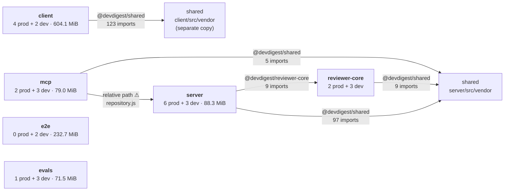

# Dependency report — 2026-08-24

## Scope

Six independent packages analysed: `server`, `client`, `reviewer-core`, `mcp`, `e2e`, `evals`. Three use pnpm (server, client, evals; pnpm-lock.yaml); three use npm (reviewer-core, e2e, mcp; package-lock.json). Numbers are supplied: manifests, resolved versions from lockfiles, measured install sizes on disk, and complete import scan from source.

**Architecture note:** This is *not* a monorepo workspace. Each package has its own `node_modules/` and lockfile. One library installed in N packages occupies the space N times over. Cross-package code reuse flows through **TypeScript path aliases** (`@devdigest/shared`, `@devdigest/reviewer-core`), not npm workspace links.

## Dependency graph



Internal edges are path aliases (the colored edges in tsconfig.json). Note the **relative import** from mcp to server (⚠) — a boundary violation.

## Size & weight

### External dependencies by exclusivity and impact

| Package | Dependency | Type | Version | Exclusive size | Import sites | Notes |
|---------|-----------|------|---------|----------------|--------------|-------|
| client | puppeteer | prod | 23.9.0 | 340.2 MiB | 1 | Browser binary; single use in PDF rendering |
| client | next | prod | 15.0.3 | 131.4 MiB | 61 | Framework core; expected size |
| e2e | playwright | dev | 1.49.0 | 210.0 MiB | 0 | Browser automation; test runner (framework-loaded) |
| server | esbuild | prod | 0.24.0 | 9.6 MiB | 0 | Build tool; should be devDependencies |
| mcp | @modelcontextprotocol/sdk | prod | 1.12.0 | 8.6 MiB | 10 | Core SDK for MCP |
| server | drizzle-orm | prod | 0.36.0 | 8.1 MiB | 31 | Database ORM |
| server | fastify | prod | 5.1.0 | 6.5 MiB | 14 | Web framework |
| server | postgres | prod | 3.4.5 | 1.2 MiB | 2 | Database driver |
| server | pino-pretty | dev | 13.0.0 | 0.7 MiB | 0* | Logger transport (config-driven, server/src/logger.ts:22) |
| server | chalk | prod | 5.3.0 | 0.1 MiB | 0 | Unreferenced; no import sites found |

*pino-pretty: loaded by configuration in pino transport options, not via direct import.

### Per-package totals

| Package | Total on disk | Breakdown |
|---------|---------------|-----------|
| client | 604.1 MiB | puppeteer 340.2 + next 131.4 + react deps + test/type tooling |
| e2e | 232.7 MiB | playwright 210.0 + typescript 23.6 |
| server | 88.3 MiB | esbuild 9.6 + drizzle-orm 8.1 + fastify 6.5 + others |
| mcp | 79.0 MiB | @modelcontextprotocol/sdk 8.6 + shared deps |
| evals | 71.5 MiB | openai + test tooling |
| reviewer-core | not measured | zod + openai + test tooling (smallest) |

### Duplication cost: TypeScript

`typescript` (5.7.4) is installed in all six packages at **23.6 MiB each** = **141.6 MiB total**. Each package maintains its own copy; no shared root `node_modules/`. This is a consequence of the package-per-lockfile layout, not a bug.

## Shared external dependencies & version drift

| Dependency | Packages | Resolved versions |
|-----------|----------|-------------------|
| **zod** | server, client, reviewer-core, mcp | 3.25.8 (server/client/reviewer-core) · **4.1.4 (mcp)** ⚠ |
| vitest | server, client, reviewer-core, mcp, evals | 2.1.9 (consistent) |
| typescript | all six | 5.7.4 (consistent) |
| openai | reviewer-core, evals | 4.77.3 (consistent) |

**zod drift:** Three packages declare `^3.24.1` and resolve to 3.25.8. `mcp` declares `^4.1.0` and resolves to 4.1.4. This is a **major version gap** — zod v3 and v4 have incompatible APIs. If mcp's `zod` instance is passed to code expecting v3, type coercion or validation will fail.

## Internal dependencies (path aliases & cross-package edges)

### Alias import counts

| Source package | Alias | Target | Import sites | Resolved to |
|---|---|---|---|---|
| server | @devdigest/reviewer-core | reviewer-core/src/index.ts | 9 | reviewer-core entry point |
| server | @devdigest/shared | server/src/vendor/shared/index.ts | 97 | server's vendor copy |
| client | @devdigest/shared | client/src/vendor/shared/index.ts | 123 | client's vendor copy |
| reviewer-core | @devdigest/shared | server/src/vendor/shared/index.ts | 9 | server's vendor copy |
| mcp | @devdigest/shared | server/src/vendor/shared/index.ts | 5 | server's vendor copy |

### Critical: Duplicate `@devdigest/shared`

**Client has its own copy** of the shared contract at `client/src/vendor/shared/index.ts`, while server, reviewer-core, and mcp all reference `server/src/vendor/shared/index.ts`. Both define `ReviewFinding` (source excerpt shows the zod schema). If the two copies diverge:
- Serialization between client and server breaks
- Type safety is illusory (different versions can coexist at runtime)
- One maintenance burden becomes two

### Critical: Relative import boundary violation

`mcp/src/tools/review.ts:4` contains:
```typescript
import { findReviewById } from "../../server/src/modules/reviews/repository.js";
```

This is a **relative import from one package directly into another's internals**, bypassing `mcp`'s own public entry point and the alias system. Risks:
- Circular dependencies if `server/modules/reviews/` ever imports from `mcp`
- Refactoring `server/modules` can break `mcp` without warning
- `repository.js` is internal; no stability contract

Should be:
```typescript
import { findReviewById } from "@devdigest/reviewer-core"; // or equivalent public export
```

## Findings & Priorities

### P0 — 1 finding (blocking/already broken)

**Relative import crossing package boundary**
- File: `mcp/src/tools/review.ts:4`
- Evidence: `import { findReviewById } from "../../server/src/modules/reviews/repository.js";` — reaches into server's internal module, not via alias
- Risk: Circular dependency, silent breakage on refactor, no contract protection
- Fix: Export `findReviewById` from reviewer-core's public API or from a shared contract; update mcp to import via alias

### P1 — 4 findings (wrong but working; costs money/time/trust)

**1. zod major version drift**
- Packages: mcp (v4.1.4) vs. server/client/reviewer-core (v3.25.8)
- Evidence: zod declarations — server: `^3.24.1`, mcp: `^4.1.0`
- Impact: Incompatible validation schemas; passing mcp-validated data to v3 code fails silently
- File: server/package.json, client/package.json, reviewer-core/package.json, mcp/package.json
- Fix: Align mcp to `^3.24.1` (if possible) OR audit all zod usage on mcp→server/client boundaries. Check: does mcp export zod schemas that server imports, or only consume?

**2. Build tool in dependencies**
- Package: server
- Evidence: esbuild 9.6 MiB declared in `dependencies`; used only in build script `"build": "esbuild src/index.ts ..."`
- Impact: Shipped with production installs; bloats runtime payload
- File: server/package.json
- Fix: Move esbuild to `devDependencies`

**3. Duplicate @devdigest/shared contract**
- Packages: client (separate copy) vs. server/reviewer-core/mcp (shared copy)
- Evidence: Two `ReviewFinding` definitions at `client/src/vendor/shared/index.ts` and `server/src/vendor/shared/index.ts`
- Impact: Schema divergence risk; client serialization can mismatch server validation
- File: client/tsconfig.json path alias, server/tsconfig.json path alias
- Fix: Unify to one copy. Options: (1) move to shared package, (2) have client use server's copy via alias, or (3) establish a sync/test contract

**4. Unreferenced dependency**
- Package: server
- Dependency: chalk 5.3.0 (0.1 MiB)
- Evidence: No import sites found in any source file; declared in server/dependencies
- Likely: Used for CLI coloring in a script not scanned, OR leftover from older code
- File: server/package.json
- Fix: Confirm chalk is actually used (grep for `chalk` in all server scripts and entry points). If unused, remove.

### P2 — 3 findings (heavyweight or drift; conscious trade-off but worth monitoring)

**1. Browser binary in production dependency**
- Package: client
- Dependency: puppeteer 340.2 MiB
- Evidence: Declared in `dependencies` (not dev), 1 import site (client/src/lib/pdf/render-pdf.ts:8)
- Impact: 340 MiB payload for one feature (PDF rendering); blocks every install
- File: client/package.json
- Assessment: Likely intentional (on-demand PDF generation), but verify: Is puppeteer used at runtime in the server/API, or only in client-side code? If client-only and optional, consider lazy-loading or moving to optional deps.

**2. Browser automation framework for e2e**
- Package: e2e
- Dependency: playwright 210.0 MiB
- Evidence: Declared in devDependencies; 0 import sites (test framework, loaded by config)
- Impact: Expected for e2e, but 210 MiB is significant; one of the two largest dependencies
- Assessment: Normal and justified. No action needed unless e2e test time becomes a concern.

**3. TypeScript duplication across six packages**
- Packages: all (141.6 MiB total, 23.6 MiB × 6)
- Evidence: typescript 5.7.4 installed in each package's node_modules
- Impact: No shared root node_modules; each package maintains its own toolchain
- Assessment: Consequence of package-per-lockfile design. Not a defect, but a cost of independence. Worth noting if a future workspace migration is considered.

### Info — 5 items (context; no action implied)

1. **vitest consistent**: All test configs use vitest 2.1.9; no version drift
2. **next framework size**: 131.4 MiB is typical for next.js with all transitive deps; 61 import sites justify the weight
3. **react ecosystem**: react + react-dom core dependencies; expected in client
4. **pino-pretty config-driven**: Declared in server devDependencies, loaded via pino transport config (server/src/logger.ts:22), not imported — normal
5. **openai consistency**: reviewer-core and evals both on 4.77.3; no drift

## Summary

1. **Fix the relative import** (P0, mcp/src/tools/review.ts:4). Replace `../../server/src/modules/reviews/repository.js` with a public alias import. This blocks safe refactoring.

2. **Align zod versions** (P1, mcp). mcp is on v4.1.4 while server/client/reviewer-core are on v3.25.8. Audit schema usage on boundaries, then either downgrade mcp to v3 or establish a validation contract if v4 is intentional.

3. **Unify @devdigest/shared** (P1, client). Client has its own copy of ReviewFinding; server/mcp/reviewer-core share another. Merge to one canonical definition and point all packages to it.

4. **Move esbuild to devDependencies** (P1, server/package.json). Currently in production dependencies despite being build-only.

5. **Confirm chalk usage** (P1, server/package.json). No imports found — verify it's actually used before removing.

**Per-package weight**: client dominates at 604 MiB (puppeteer 340 + next 131); e2e at 232 MiB (playwright 210); server at 88 MiB; others under 80 MiB. Puppeteer and playwright are the two largest single dependencies, both justified for their use cases (PDF rendering, e2e testing).
