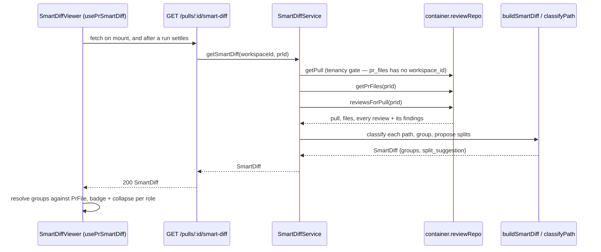

# Smart Diff — ordering a PR's files by risk

`GET /pulls/:id/smart-diff` returns the `SmartDiff` contract
(`server/src/vendor/shared/contracts/brief.ts:101-134`): the PR's changed
files grouped into `core → wiring → boilerplate`, each file carrying the
line numbers of findings that landed on it, plus a suggestion for splitting
an oversized PR. It backs the Diff tab's default view. **It is fully
deterministic and makes no model call** — it recombines data the app already
has (`pr_files`, and every review's findings) rather than asking an LLM to
rank anything.

This doc explains the rationale that isn't obvious from either side of the
wire alone: why every review counts (not just the latest), why the group
order is fixed, and why the client always has a way back to the plain diff.
The classification rules themselves — the pattern list, the split
thresholds — are read from `server/src/modules/smart-diff/constants.ts`,
which is their source of truth; this doc doesn't restate them.

## Request path

- **Server:** `server/src/modules/smart-diff/{routes,service,helpers,constants}.ts`,
  registered in `server/src/modules/index.ts`. No repository, no new SQL —
  `SmartDiffService` reads through `container.reviewRepo`, the cross-module
  seam already used for reads that don't own their own tables
  (`server/src/modules/smart-diff/service.ts:12-17`).
- **Client:** the hook is `usePrSmartDiff` in `client/src/lib/hooks/reviews.ts`;
  the rendering is `client/src/app/repos/[repoId]/pulls/[number]/_components/SmartDiffViewer/`,
  mounted by `DiffTab.tsx` in place of the plain `DiffViewer`.

## Why every review, not just the latest

`finding_lines` on each file is built from **every** `kind:'review'` review
of the PR, dismissed findings excluded (`service.ts:49-65`, the
`reviewFindings` method). A re-run that hits an empty or unchanged diff
writes a new review with zero findings — using only the latest review would
have silently erased the lines an earlier, real review flagged.

The rule matches one the PR list already had to make for its own findings
column, for the same reason: `server/src/modules/pulls/routes.ts:174-177`
sums findings across every review of a PR — unlike `score`, which is
deliberately latest-only — "so the number matches what the detail page shows
once you click a counter through to it." Smart Diff's badges make the same
promise for the reader who lands on the diff directly: they should never
disagree with the counter the reader clicked through.

## Grouping and ordering

- Groups always render in the fixed order `core, wiring, boilerplate`
  (`ROLE_ORDER`, `constants.ts:84`) — even an empty group is emitted, so the
  client's layout doesn't shift PR to PR.
- Within a group, files sort by finding count (desc), then changed lines
  `additions+deletions` (desc), then path (asc) — a total order, so nothing
  is left to insertion order (`helpers.ts:121-131`, `sortGroup`).
- Classification is **path-pattern only** — a lock file, a boilerplate glob,
  or a wiring glob, checked in that order, with `core` as the default for
  everything else (`helpers.ts:69-74`, `classifyPath`). A file's patch text
  is never inspected; a `pr_files` row with `patch: null` classifies exactly
  like one with a patch.
- `split_suggestion.too_big` fires when the PR's total changed lines exceed
  `SPLIT_TOO_BIG_LINES` (constants.ts); the proposed splits group
  non-boilerplate files by their first two path segments and append one
  boilerplate "chore" split (`helpers.ts:147-176`, `proposeSplits`).

## Client rendering

- `SmartDiffViewer` maps each `SmartDiffGroup`'s paths back onto the PR's
  real `PrFile` rows (the response carries paths and stats, not patch text)
  and forwards a `fileMeta` prop — `defaultOpen`/`findingLines` per path —
  into the shared `DiffViewer`/`FileCard` (`SmartDiffViewer/helpers.ts`).
  Any `PrFile` the response doesn't mention (a ranking gap) is appended as an
  "ungrouped" tail so a file never silently vanishes from the tab
  (`ungroupedFiles`, same file).
- The `boilerplate` group starts collapsed regardless of its files' size;
  `core`/`wiring` leave `FileCard`'s own size heuristic in charge
  (`DEFAULT_OPEN_BY_ROLE`, `SmartDiffViewer/constants.ts`).
- A file's finding badge (`FileCard.tsx`) opens the card and scrolls to a
  flagged line via a `data-line` anchor on `CodeLine`; clicking it again
  cycles to the next finding line rather than re-jumping to the same one
  (`jumpToFinding`, ref-held cycle index + a scroll nonce so the same line
  can be re-targeted twice in a row).
- **Fallback is unconditional.** On a fetch error, an empty response
  (`totalGrouped === 0`), or before a review exists, `SmartDiffViewer` renders
  the plain `DiffViewer` with the unranked files instead — the tab must never
  lose the diff because ranking failed (`SmartDiffViewer.tsx:96-99`).
- After a run settles, `page.tsx` invalidates the `['pr-smart-diff', prId]`
  query alongside the review queries, so badges appear without a reload.

## What it deliberately doesn't do

- No `repo-intel` blast-radius signal — that facade degrades to `[]` on an
  unindexed repo, which would make classification differ machine to machine.
- No `pseudocode_summary` — the contract field is `.nullish()` and stays
  unset; producing it would need a model call, which this endpoint doesn't make.
- No refresh from GitHub — it reads whatever `pr_files` already holds.
  `GET /pulls/:id` is what refreshes that table (`pulls/routes.ts:249-258`);
  this endpoint is a pure read.

## Tests

- `server/test/smart-diff.test.ts` — unit: classification per pattern,
  ordering, `finding_lines` dedup, the `too_big` boundary.
- `server/test/smart-diff.it.test.ts` — integration: the route end-to-end
  against a seeded PR, tenancy (404/422), and that the request makes no LLM call.
- `client/src/app/repos/[repoId]/pulls/[number]/_components/SmartDiffViewer/SmartDiffViewer.test.tsx` —
  grouping, collapse defaults, badge navigation, and the plain-diff fallback.
- `e2e/specs/09-pr-smart-diff.flow.json` — read-only browser check that the
  Files-changed tab groups seeded PR #482 by role (see `e2e/README.md`).
